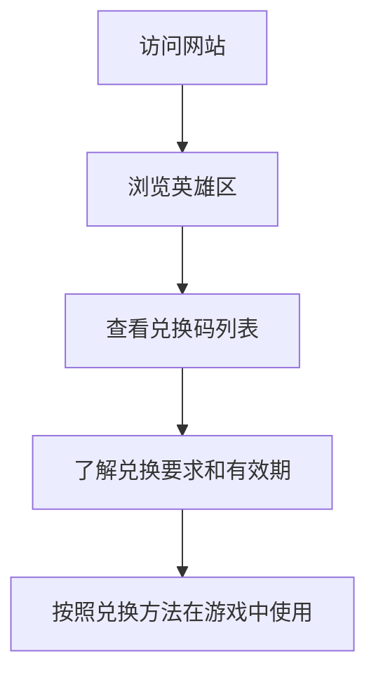

## 1. Product Overview
无尽冬日兑换码网站是一个专门收集和展示游戏《无尽冬日》官方兑换码的平台，为玩家提供最新、最全面的兑换码信息。
- 解决玩家需要手动搜索兑换码的问题，提供集中、自动更新的兑换码资源
- 目标用户为《无尽冬日》游戏玩家，帮助他们快速获取游戏福利

## 2. Core Features

### 2.1 User Roles
| 角色 | 注册方式 | 核心权限 |
|------|----------|----------|
| 普通用户 | 无需注册 | 浏览兑换码、查看兑换方法 |

### 2.2 Feature Module
1. **首页**：英雄区、兑换码列表、兑换方法指南、网站说明

### 2.3 Page Details
| 页面名称 | 模块名称 | 功能描述 |
|----------|----------|----------|
| 首页 | 英雄区 | 展示游戏主题元素，营造冬日氛围，吸引用户注意 |
| 首页 | 兑换码列表 | 显示最新兑换码，包含兑换码内容、有效期、兑换要求等信息 |
| 首页 | 兑换方法指南 | 详细说明如何在游戏中使用兑换码，包含步骤图解 |
| 首页 | 网站说明 | 介绍网站功能、更新频率、数据来源等信息 |

## 3. Core Process
用户访问网站后，首先看到英雄区的游戏主题展示，然后向下滚动查看最新的兑换码列表，了解每个兑换码的有效期和使用要求。用户可以根据兑换方法指南在游戏中使用兑换码获取奖励。

## 4. User Interface Design
### 4.1 Design Style
- 主色调：深蓝色(#1a1a2e)和白色(#ffffff)，辅以浅蓝色(#4a90e2)作为强调色
- 按钮风格：圆角按钮，带有轻微的阴影效果
- 字体：主标题使用无衬线字体，正文使用清晰易读的字体
- 布局风格：单页面滚动设计，卡片式布局展示兑换码
- 图标风格：简约线条图标，符合游戏主题的冬日元素

### 4.2 Page Design Overview
| 页面名称 | 模块名称 | UI元素 |
|----------|----------|--------|
| 首页 | 英雄区 | 全屏背景展示游戏冬日场景，居中显示网站标题和简短描述，使用渐变效果增强视觉冲击力 |
| 首页 | 兑换码列表 | 卡片式布局，每个卡片包含兑换码、有效期、兑换要求等信息，使用不同颜色标识不同状态的兑换码 |
| 首页 | 兑换方法指南 | 步骤式展示，包含文字说明和示意图，使用图标增强可读性 |
| 首页 | 网站说明 | 简洁的文字说明，使用卡片式布局，包含更新时间等信息 |

### 4.3 Responsiveness
- 桌面端优先设计，同时支持移动端适配
- 在小屏幕设备上自动调整布局，确保内容清晰可读
- 触摸优化，确保按钮和链接在移动设备上易于点击

### 4.4 3D Scene Guidance
- 可考虑在英雄区添加简单的3D雪花效果，增强冬日氛围
- 使用CSS动画实现雪花飘落效果，无需复杂的3D渲染