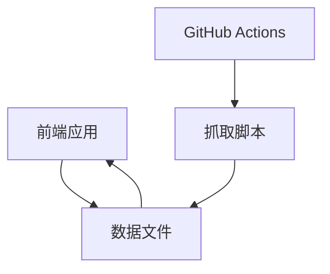
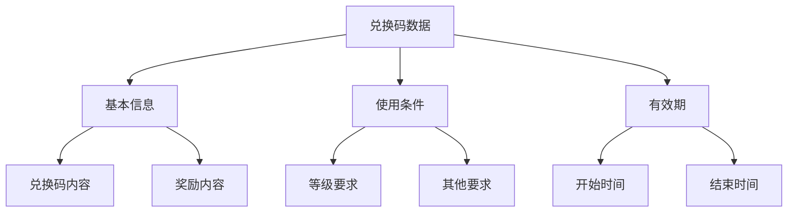

## 1. Architecture Design


## 2. Technology Description
- 前端：React@18 + Tailwind CSS@3 + Vite
- 初始化工具：vite-init
- 后端：无（使用静态数据文件）
- 数据存储：JSON文件
- 自动抓取：Python脚本 + GitHub Actions

## 3. Route Definitions
| 路由 | 用途 |
|------|------|
| / | 首页，包含所有内容 |

## 4. API Definitions
无API，直接读取本地JSON数据文件

## 5. Server Architecture Diagram
无后端架构

## 6. Data Model
### 6.1 Data Model Definition


### 6.2 Data Definition Language
JSON数据结构：

```json
[
  {
    "code": "EXAMPLECODE",
    "reward": "100钻石 + 500金币",
    "level_requirement": 10,
    "start_time": "2024-01-01T00:00:00",
    "end_time": "2024-01-31T23:59:59",
    "other_requirements": "无",
    "source": "官方公告",
    "date_added": "2024-01-01T10:00:00"
  }
]
```

### 6.3 自动抓取机制
1. 使用Python脚本定期抓取TapTap官方论坛的公告
2. 解析公告内容，提取兑换码信息
3. 更新JSON数据文件
4. 使用GitHub Actions设置每天自动执行抓取任务

### 6.4 技术实现要点
- 前端使用React和Tailwind CSS构建响应式界面
- 使用Vite作为构建工具，确保快速开发和部署
- 数据存储使用JSON文件，便于GitHub Actions更新
- 自动抓取脚本使用Python的requests和BeautifulSoup库
- GitHub Actions配置为每天执行一次抓取任务